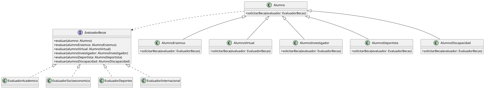
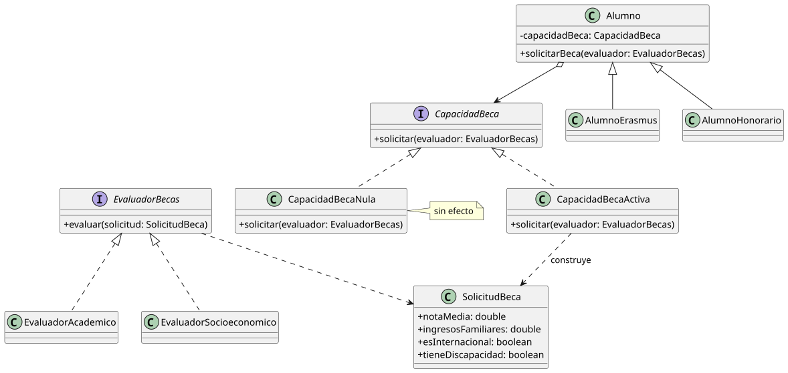

# OCP08 - Composición sobre herencia

La tabla de [OCP07](../OCP07/README.md) dejaba tres salidas. El Camino C prometía extraer la capacidad de solicitar beca como pieza componible. Vamos a recorrerlo.

## La solución local

En el diseño anterior, la jerarquía de herencia era el mecanismo para diferenciar comportamiento: cada subclase sobreescribe `solicitarBeca` para que el despacho llegue al evaluador con el tipo correcto. Eso funciona mientras todos los alumnos compartan esa capacidad. Cuando aparece uno que no la tiene, la jerarquía revela que estaba haciendo dos cosas a la vez: modelar el tipo de alumno, y transportar la variación de comportamiento de evaluación.

La idea es separar esas dos responsabilidades. `solicitarBeca` deja de ser un método que cada subclase sobreescribe. Pasa a ser una responsabilidad delegada en un colaborador: `CapacidadBeca`.

```java
interface CapacidadBeca {
    void solicitar(EvaluadorBecas evaluador)
}

class CapacidadBecaNula implements CapacidadBeca {
    void solicitar(EvaluadorBecas evaluador) {
        // sin efecto - Null Object
    }
}

class Alumno {
    private CapacidadBeca capacidadBeca

    void solicitarBeca(EvaluadorBecas evaluador) {
        capacidadBeca.solicitar(evaluador)
    }
}
```

Cada subclase configura su capacidad en construcción:

```java
class AlumnoErasmus extends Alumno {
    AlumnoErasmus(id, nombre, email, paisOrigen, universidadOrigen) {
        super(id, nombre, email)
        configurarBeca(new CapacidadBecaActiva(...))  // qué lleva dentro: sección siguiente
    }
}

class AlumnoHonorario extends Alumno {
    AlumnoHonorario(id, nombre, email) {
        super(id, nombre, email)
        configurarBeca(new CapacidadBecaNula())
    }
}
```

¿Por qué esto es mejor que el no-op de OCP07?

En OCP07, `AlumnoHonorario` sobreescribía `solicitarBeca` con un cuerpo vacío. El comportamiento externo era idéntico: no ocurría nada. Pero el no-op violaba el contrato de `Alumno` (la promesa de que `evaluar` sería invocado) y lo hacía sin dejar rastro. El compilador no decía nada y el sistema tampoco.

Aquí el contrato de `Alumno.solicitarBeca()` es distinto: "la capacidad configurada será ejecutada". Eso siempre se cumple, incluido para `AlumnoHonorario`. No hay violación porque no hay promesa incumplida. La ausencia de efecto no es un silencio sospechoso: está declarada en el tipo que se inyecta. Quien lea `configurarBeca(new CapacidadBecaNula())` sabe exactamente qué decidió el diseñador y por qué.

El problema inmediato de OCP07 está resuelto.

## El sistema que queda

Pero el doble despacho sigue ahí.

<div align=center>



</div>

Cada subclase de `Alumno` sobreescribe `solicitarBeca` para que `evaluador.evaluar(this)` resuelva la sobrecarga correcta. `EvaluadorBecas` declara un método por tipo de alumno. Cada evaluador concreto los implementa todos.

El coste se vuelve visible cuando el sistema crece:

- Añadir un tipo de alumno: crear la subclase, añadir su sobrecarga en `EvaluadorBecas`, implementarla en cada evaluador concreto. El cambio se propaga.
- Añadir un evaluador: implementar N métodos desde el primer día, aunque solo necesite lógica propia para dos tipos.
- La jerarquía de `Alumno` y la jerarquía de evaluadores están acopladas. Una no puede crecer sin notificar a la otra.

N tipos de alumno, M evaluadores: el sistema crece en N×M.

## La pregunta que no hicimos

Al extraer `CapacidadBeca`, algo se hace visible que antes era implícito. El doble despacho no era una solución elegante: era la respuesta forzada a una pregunta que nunca habíamos formulado en voz alta.

**¿Por qué el evaluador necesita el tipo del alumno?**

La respuesta honesta es que no lo necesita. El evaluador necesita datos: la nota media del alumno, sus ingresos familiares, si tiene alguna condición especial, si es estudiante internacional. El tipo era el proxy para esos datos -la herencia los había enterrado dentro de los subtipos, y la única forma de extraerlos era conocer el tipo concreto.

Si esos datos viajaran directamente, sin intermediario de tipo, el evaluador no necesitaría saber qué subclase tiene delante.

## El rediseño

La capacidad de beca no solo decide si el alumno participa en la evaluación. También construye lo que el evaluador necesita para evaluar.

```java
class SolicitudBeca {
    double notaMedia
    double ingresosFamiliares
    boolean esInternacional
    boolean tieneDiscapacidad
    // los datos que los evaluadores necesitan
}

class CapacidadBecaActiva implements CapacidadBeca {
    private SolicitudBeca solicitud

    void solicitar(EvaluadorBecas evaluador) {
        evaluador.evaluar(solicitud)
    }
}
```

Cada subclase configura su capacidad con los datos que le son propios:

```java
class AlumnoErasmus extends Alumno {
    AlumnoErasmus(id, nombre, email, paisOrigen, universidadOrigen) {
        super(id, nombre, email)
        configurarBeca(new CapacidadBecaActiva(
            new SolicitudBeca(notaMedia, ingresosFamiliares, esInternacional=true, ...)
        ))
    }
}
```

`EvaluadorBecas` pasa a tener un único método:

```java
interface EvaluadorBecas {
    void evaluar(SolicitudBeca solicitud)
}
```

<div align=center>



</div>

Los evaluadores concretos reciben siempre el mismo tipo. No hay sobrecargas. No hay acoplamiento con la jerarquía de alumnos.

```java
class EvaluadorAcademico implements EvaluadorBecas {
    void evaluar(SolicitudBeca solicitud) {
        if (solicitud.notaMedia >= 8.0) {
            // conceder beca académica
        }
    }
}
```

`Universidad` no cambia. Los dos tipos de alumno pasan por el mismo código:

```java
universidad.procesarSolicitudBeca(alumnoErasmus, evaluador)    // evaluar(solicitud) es invocado
universidad.procesarSolicitudBeca(alumnoHonorario, evaluador)  // CapacidadBecaNula - sin efecto
```

Sin `instanceof`. Sin excepción. Sin guardia. La diferencia de comportamiento está en lo que cada alumno lleva dentro, no en cómo `Universidad` los trata.

## Lo que cambia

<div align=center>

| | Con doble despacho | Con composición |
|---|---|---|
| `EvaluadorBecas` | N métodos, uno por tipo de alumno | Un solo `evaluar(SolicitudBeca)` |
| Añadir tipo de alumno | Modifica `EvaluadorBecas` + todos los evaluadores | Crea su `CapacidadBecaActiva` con sus datos |
| Añadir evaluador | Implementa N métodos desde el principio | Implementa un método |
| `AlumnoHonorario` | Viola el contrato del doble despacho | Recibe `CapacidadBecaNula` - sin contrato que violar |
| Jerarquía de `Alumno` | Acoplada al sistema de evaluación | Independiente |
| `Universidad` | Sin cambios | Sin cambios |

</div>

El sistema pasa de crecer en N×M a crecer en N+M. Añadir un tipo de alumno y añadir un evaluador son operaciones independientes.

## Composición sobre herencia

La frase no significa eliminar la herencia. `AlumnoHonorario` sigue siendo `extends Alumno`. La herencia es correcta para lo que todos los alumnos comparten: identidad, datos de matrícula, ciclo de vida en el sistema.

Lo que la composición reemplaza es el uso de la herencia para transportar variación de comportamiento. En el diseño anterior, ser `AlumnoErasmus` significaba dos cosas simultáneas: tener los datos propios de un alumno Erasmus, y saber exactamente cómo presentarse ante el evaluador. La segunda responsabilidad no pertenecía a la jerarquía.

Con composición, la jerarquía de `Alumno` expresa solo identidad. La variación de comportamiento vive en `CapacidadBeca` -una pieza cohesiva que puede cambiarse, reutilizarse o anularse sin tocar la jerarquía.

El doble despacho fue la respuesta OO correcta a la pregunta equivocada. La pregunta era: *¿cómo diferencio comportamiento por tipo de alumno sin `instanceof`?* La pregunta correcta era: *¿por qué el evaluador necesita el tipo del alumno en lugar de recibir directamente los datos que necesita?*

Formular la pregunta correcta hizo innecesaria la respuesta ingeniosa.

## El límite del rediseño

`SolicitudBeca` funciona si los datos que los evaluadores necesitan son aspectos del mismo alumno: nota media, ingresos familiares, si es internacional, si tiene discapacidad. Son dimensiones ortogonales que conviven sin conflicto en un mismo objeto. Cada evaluador usa los campos que le importan e ignora el resto.

Pero si los evaluadores son genuinamente heterogéneos -si el evaluador de deportes necesita federación, categoría y historial de competición que un `AlumnoErasmus` nunca tendrá- `SolicitudBeca` se convierte en un objeto bolsa con campos vacíos para la mayoría de los casos. El diseño gana cohesión en un eje y la pierde en otro.

Hay dos lecturas posibles:

<div align=center>

|Primera lectura|Segunda lectura|
|-|-|
La heterogeneidad es aparente.|Los datos son tan específicos por evaluador que no conviven en un objeto común sin ruido.
Los criterios de evaluación son aspectos del alumno, no del tipo de alumno. Todo alumno tiene nota media, tiene ingresos, tiene o no tiene condición especial.|En ese caso el problema migra: haría falta una jerarquía de solicitudes, interfaces segregadas o un modelo de datos más rico. 
`SolicitudBeca` es un DTO legítimo y el rediseño es sólido.|El doble despacho volvería, pero sobre solicitudes en lugar de alumnos.

</div>

Ningún análisis técnico decide entre las dos: lo que decide es el conocimiento del dominio.

|||
|-|-|
|Si el sistema real tiene cuatro o cinco criterios compartidos y los tipos especiales son la excepción, `SolicitudBeca` única es la respuesta correcta.|Si cada evaluador necesita una vista radicalmente distinta, el rediseño se detiene aquí y necesita otro punto de entrada.

El diseño no sabe qué sistema se está construyendo. El dominio sí.

## Los nombres de lo que acabamos de ver

**Patrón Estrategia** (*Strategy*). `CapacidadBeca` es una interfaz que encapsula un algoritmo intercambiable. `Alumno` la usa sin saber qué implementación tiene dentro. Ese mecanismo tiene nombre desde 1994: es uno de los patrones de diseño de Gamma et al. OCP08 lo ha construido desde cero siguiendo la lógica del problema; el patrón es el destino al que lleva esa lógica.

**Inversión de Control**. En el diseño anterior, `Universidad` controlaba el flujo: llamaba a `alumno.solicitarBeca()` sabiendo implícitamente qué ocurriría según el tipo. En el rediseño, `Universidad` sigue llamando a `solicitarBeca()`, pero ya no controla qué pasa dentro - ese control lo tiene la `CapacidadBeca` inyectada. El cliente llama; la implementación decide. Es el Principio Hollywood: *"No me llames, ya te llamaremos"*.

La Inversión de Control tiene dos formas en OO. Con herencia: la clase base define el esqueleto y las subclases rellenan los pasos (Patrón Método Plantilla). Con composición: la clase delega en un colaborador inyectado (Strategy). El hilo OCP ha recorrido las dos.

Ya se vio en la práctica: [`Mazo.mostrar()`](https://github.com/mmasias/23-24-pyKlondike/blob/toHeirIsHuman/src/Mazo.java) define el esqueleto del algoritmo - imprime el título, comprueba si hay cartas, delega en `mostrarContenido()`. Cada subclase rellena ese paso. El cliente llama a `mostrar()`; la subclase decide qué ocurre en el interior.

**Jerarquías Paralelas de Herencia**. El coste N×M que describía "El sistema que queda" tiene nombre de *code smell*: cada vez que se añade una subclase de `Alumno`, hay que añadir una sobrecarga en `EvaluadorBecas` y una implementación en cada evaluador concreto. Dos jerarquías que crecen en paralelo, acopladas. La solución es siempre la misma: delegación y reparto de responsabilidades.

<br><br><br><br><br><br><br><br><br><br><br><br><br><br><br><br><br><br><br><br><br><br><br><br><br>
