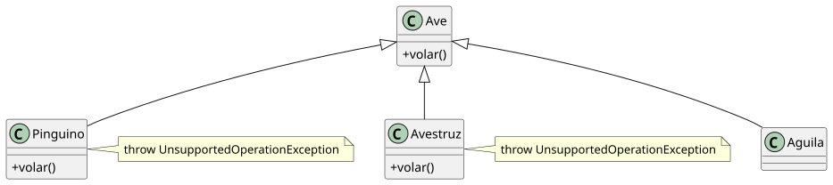
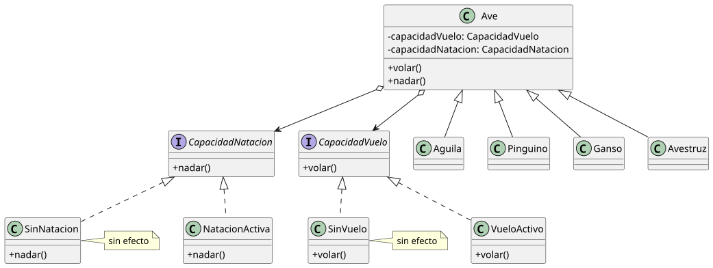

# El pájaro y el pingüino

Todos los pájaros vuelan. Eso dice la jerarquía. Entonces llega el pingüino, y la jerarquía miente.

## El estado inicial

```java
class Ave {
    void volar() {
        // despegar, mover alas, planear
    }
}

class Pinguino extends Ave {
    void volar() {
        throw new UnsupportedOperationException("Los pingüinos no vuelan")
    }
}
```

<div align=center>



</div>

El contrato de `Ave` promete que `volar()` hace algo. `Pinguino` lo rompe. Cualquier código que llame a `ave.volar()` asumiendo que el vuelo ocurre tiene un problema cuando el ave es un pingüino.

La alternativa - dejar el cuerpo vacío - es peor: silencio administrativo. El llamador no recibe error, no recibe señal, no recibe nada. No puede distinguir si el vuelo ocurrió o si simplemente no pasó nada.

## La solución local

La capacidad variable se extrae como colaborador.

```java
interface CapacidadVuelo {
    void volar()
}

class VueloActivo implements CapacidadVuelo {
    void volar() {
        // despegar, mover alas, planear
    }
}

class SinVuelo implements CapacidadVuelo {
    void volar() {
        // sin efecto - Null Object
    }
}

class Ave {
    private CapacidadVuelo capacidadVuelo

    void volar() {
        capacidadVuelo.volar()
    }
}

class Aguila extends Ave {
    Aguila() {
        super()
        configurarVuelo(new VueloActivo())
    }
}

class Pinguino extends Ave {
    Pinguino() {
        super()
        configurarVuelo(new SinVuelo())
    }
}
```

`Pinguino` ya no hereda una capacidad que no tiene. Declara explícitamente que no vuela. El contrato de `Ave` se cumple siempre: la capacidad configurada será ejecutada.

## El sistema que queda

Las aves tienen más capacidades variables que el vuelo. Nadan. Corren. Algunas hacen las tres cosas; otras, ninguna.

Con herencia, cada combinación necesita una subclase: `AveQueVuela`, `AveQueNada`, `AveQueVuelaYNada`, `AveQueVuelaYCorre`... El número de subclases crece con cada capacidad que se añade.

Con composición, cada capacidad es una pieza independiente. Añadir `CapacidadNatacion` no modifica `CapacidadVuelo` ni las subclases existentes.

## El rediseño

```java
class Ave {
    private CapacidadVuelo capacidadVuelo
    private CapacidadNatacion capacidadNatacion

    void volar() { capacidadVuelo.volar() }
    void nadar() { capacidadNatacion.nadar() }
}

class Ganso extends Ave {        // vuela y nada
    Ganso() {
        super()
        configurarVuelo(new VueloActivo())
        configurarNatacion(new NatacionActiva())
    }
}

class Pinguino extends Ave {     // nada, no vuela
    Pinguino() {
        super()
        configurarVuelo(new SinVuelo())
        configurarNatacion(new NatacionActiva())
    }
}

class Avestruz extends Ave {     // no vuela, no nada
    Avestruz() {
        super()
        configurarVuelo(new SinVuelo())
        configurarNatacion(new SinNatacion())
    }
}
```

<div align=center>



</div>

Añadir un nuevo tipo de ave es configurar combinaciones existentes. Añadir una nueva capacidad no afecta a las demás. Las jerarquías no crecen en paralelo.

La herencia modela lo que todas las aves comparten: identidad, ciclo de vida. La composición modela lo que varía: qué puede hacer cada una.

<br><br><br><br><br><br><br><br><br><br><br><br><br><br><br><br><br><br><br><br><br><br><br><br><br>
