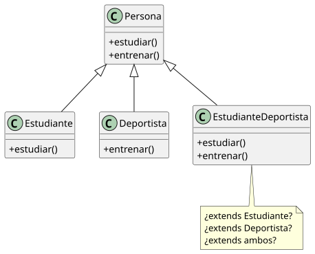
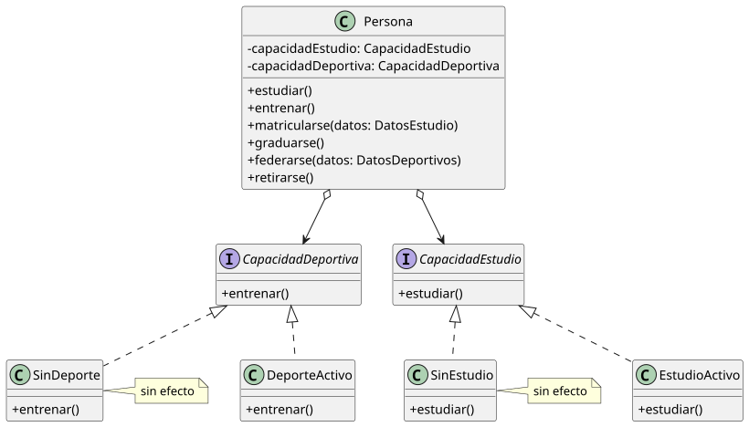

# La persona y sus roles

Una persona puede ser estudiante, deportista, o ambas cosas. Y puede dejar de serlo. La herencia no modela eso: la clase se asigna en construcción y no cambia. Lo que cambia no es lo que la persona *es*, sino lo que la persona *tiene ahora mismo*.

## El estado inicial

Con herencia, cada combinación necesita una subclase.

<div align=center>



</div>

El problema no es solo la explosión combinatoria. Es que la clase se asigna en construcción y no cambia. Una persona que se matricula no puede "convertirse" en `Estudiante` en tiempo de ejecución. Una persona que se gradúa no puede dejar de serlo. La herencia modela lo que algo *es*, no lo que algo *tiene ahora mismo*.

## La solución local

Cada rol se extrae como colaborador.

```java
interface CapacidadEstudio {
    void estudiar()
}

class EstudioActivo implements CapacidadEstudio {
    void estudiar() {
        // asistir a clase, preparar exámenes, entregar trabajos
    }
}

class SinEstudio implements CapacidadEstudio {
    void estudiar() {
        // sin efecto - Null Object
    }
}
```

```java
class Persona {
    private CapacidadEstudio capacidadEstudio
    private CapacidadDeportiva capacidadDeportiva

    Persona() {
        this.capacidadEstudio  = new SinEstudio()
        this.capacidadDeportiva = new SinDeporte()
    }

    void estudiar()  { capacidadEstudio.estudiar() }
    void entrenar()  { capacidadDeportiva.entrenar() }
}
```

Una persona recién creada no tiene ningún rol activo. Las capacidades nulas declaran ese estado explícitamente.

## El rediseño

Las capacidades se pueden asignar y revocar en tiempo de ejecución.

```java
class Persona {
    ...
    void matricularse(DatosEstudio datos) {
        this.capacidadEstudio = new EstudioActivo(datos)
    }

    void graduarse() {
        this.capacidadEstudio = new SinEstudio()
    }

    void federarse(DatosDeportivos datos) {
        this.capacidadDeportiva = new DeporteActivo(datos)
    }

    void retirarse() {
        this.capacidadDeportiva = new SinDeporte()
    }
}
```

La misma instancia de `Persona` atraviesa estados distintos a lo largo del tiempo:

```java
Persona persona = new Persona("Ana")
// estudiar() -> SinEstudio  - sin efecto
// entrenar() -> SinDeporte  - sin efecto

persona.matricularse(new DatosEstudio(grado, universidad))
// estudiar() -> EstudioActivo

persona.federarse(new DatosDeportivos(natacion, federacion))
// estudiar() -> EstudioActivo
// entrenar() -> DeporteActivo

persona.graduarse()
// estudiar() -> SinEstudio   - rol desactivado
// entrenar() -> DeporteActivo - rol sigue activo
```

<div align=center>



</div>

## La pregunta que cambia este ejemplo

Con herencia, la pregunta es: *¿puede esta instancia hacer X?* La respuesta es fija por tipo.

Aquí la pregunta es: *¿tiene esta instancia el rol que le permite hacer X ahora mismo?*

La diferencia no es técnica: es conceptual. Ser estudiante no es lo que una persona *es*. Es lo que una persona *tiene* en un momento dado. La herencia no puede modelar eso. La composición sí.

<br><br><br><br><br><br><br><br><br><br><br><br><br><br><br><br><br><br><br><br><br><br><br><br><br>
